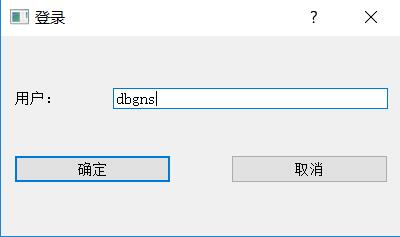

# 图像标注软件
------------------------------
> For an English version please view README_en.md

### 简介
&nbsp;&nbsp; 本 repo 是 fork from [tzutalin](https://github.com/tzutalin/labelImg)并作出了一定修改。修改主要包括:
* 改为中文界面
* 增加登录(伪登录，只需提供用户名，该用户名会在后续的标注或核验操作中被记录到xml文件中)
* 增加核验功能(recheck)
* 对文件列表进行一定的优化，如增加状态记录, 自动排序，重定位，高亮等

### 增加登录
 

### 增加核验功能
 

### 操作者信息记录
* 如上图右上角，记录本图片的标注者与标注时间，当前用户的用户名

### 文件列表
* 三种状态，从上往下依次是: 未核验, 未标注，已核验
* 若操作者为标注者，则不勾选"我要核验"，标注完一张图片后会定位到未标注的图片
* 若操作者为核验者，则在其勾选"我要核验"后，当前图片会定位到未核验的图片

### 环境依赖
* 跨平台，linux,windows,mac均可，具体安装过程参照 [tzutalin的repo](https://github.com/tzutalin/labelImg)
* PyQt5 开发，且为保持兼容 加入了 PyQt4

### Windows下打包
* `pip install pipenv`
* `pipenv sync`
* `pipenv run pyinstaller -F labelImg.py`
* 在 dist 文件夹中找到labelImg.exe 即可运行使用。

| 注意: 如果使用过原版的`labelimg`,请先在电脑里找到`.labelImgSettings.pkl`文件并删除  |
| --- |

### 下载编译好的二进制包
[下载地址](https://github.com/SuJiKiNen/My-LabelImg/releases/download/qt5_build/labelimg.zip)

### 作者
* [王俊杰](http://120.79.231.160)
* [项目主页](http://120.79.231.160/labelImg)

有任何问题欢迎开issue或直接email。
