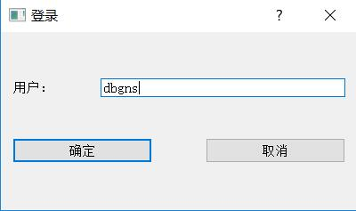

# LabelImg
-----------------------------------

### Introduction
&nbsp;&nbsp;This repo is forked from [tzutalin](https://github.com/tzutalin/labelImg) and I have made some modifications. Major modifications include:
* Text are all translated into Chinese, <bold>if necessary, you can translate them back according to tzutalin's repo</bold>
* Add the login step(false login, namely only the username is needed, which will be recorded in the xml file in future operations)
* Add the recheck functions
* Optimize the file lists(.e.g, add the records of states, auto-sorting, redirecting and hightights)

### Login Step
 
 
### Recheck Function
 
 
### Records Of The Users
* As you can see in the image above, information about the users and previous labellers are recorded and loaded.
 
### File List
* Three states, from up to down: checked, unchecked, unlabelled
* If current user is a labeller, don't tick "I want to check", then when you finish labelling one image, a unlabelled image will be loaded
* If current user is a checker, tick "I want to check", then when you finish checking one image, a unchecked but already labelled image will be loaded

### Environment Requirements
* Cross-platform，linux,windows,mac are all OK，details installation process please refer to [tzutalin](https://github.com/tzutalin/labelImg)
* Developed with PyQt5, and for compatibility, PyQt4 is added.
    
### Packing(using pyinstaller)
	'pip install pyinstaller'
    'pyinstall -m labelImg.py'
    Then you will find the 'dist' directory in current directory. Then copy the platforms directory in Qt library(qwindows.dll and other dlls) into dist directory.
	Then you will see labelImg.exe and just run it!
	
### Author
	[Junjie Wang](http://120.79.231.160)
	[Project MainPage](http://120.79.231.160/labelImg)
	
A star will be highly appreciated.
Welcome to any issues or disscussion.